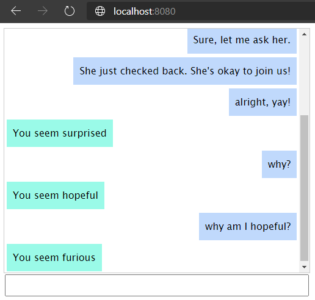

## Day 1: Sentiment Classification

### Setup
1. Install Python dependencies
    ```
    pip install -r ../requirements.txt
   ```
2. Train model to predict sentiment of text
    ```
    python train.py
    ```
3. Run Flask app
   ```
    cd app/demo
    flask run
   ```
4. Go to http://localhost:8080. Type your chat responses, and the bot will reply with "You seem <sentiment>".

    
