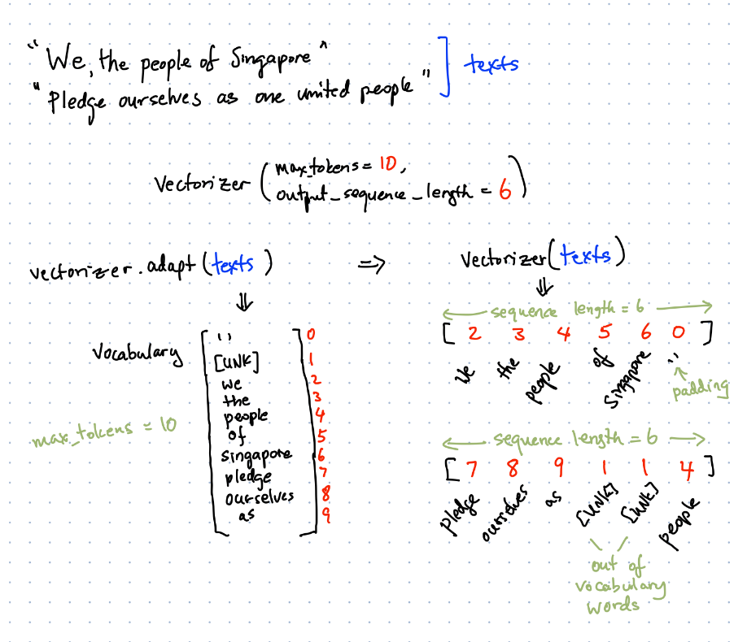

## Text Vectorization
Text vectorization performs pre-processing to convert words into numbers.

It typically performs two steps:
1. vectorizer.adapt(corpus): One-time initialization. **Generates the vocabulary** based on the unique words of the **corpus**, subject to a limit of `max_tokens`.
2. vectorizer(text): Performs the **vectorization** on **any input text**. This typically does pre-processing (tokenization based on whitespace, stripping of punctuation, lower-casing, and padding/truncation to a fixed `output_sequence_length`) before replacing each 
tokenized word with its index into the vocabulary. Any new words not in the vocabulary will be assumed to be `[UNK]` (out-of-vocab).



The following settings are most commonly used for vectorization:
- max_tokens: limits the size of the vocabulary. This does not include the padding token ('') and the out-of-vocabulary token ([Unk]). If not set, this will default to the number of unique tokens in all texts.
- output_sequence_length: limits the length of the output sequences. Each row of text will be truncated or zero-padded to match this length. If not set, this will default to the longest sequence.

These are the default settings:
```
tf.keras.layers.experimental.preprocessing.TextVectorization(
    max_tokens=None, standardize=LOWER_AND_STRIP_PUNCTUATION,
    split=SPLIT_ON_WHITESPACE, ngrams=None, output_mode=INT,
    output_sequence_length=None, pad_to_max_tokens=True, **kwargs
)
```
### Usage Notes
`TextVectorization` provides a quick way to convert text to sequences as input to the neural network. If you need to convert back from numeric sequences to text, you can refer to Day2's code, where we will use `tensorflow.keras.preprocessing.text.Tokenizer` to do the conversion in both directions (`tensorflow.keras.preprocessing.text.Tokenizer` is slightly more complicated to use because it does not do padding).

[Documentation](https://www.tensorflow.org/api_docs/python/tf/keras/layers/experimental/preprocessing/TextVectorization)