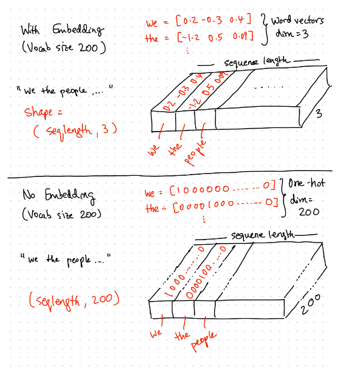

## Word Embeddings

When processing text, word embeddings are often used to represent large vocabularies with a compressed vector.

For example, if we have 200 unique words in our vocabulary:
- No embedding: 200 features per word per row. 
- With embedding (of output dimension 3): 3 features per word per row

```
Corpus:
  ['we the citizens of singapore',
  'pledge ourselves as one united people']
  
  Given: 
  - Vocabulary size = 200 (number of unique words)
  - Sequence length = 6 (number of words per row)

With Embedding (word vectors of dimension 3):

  'we the citizens of singapore<PAD>' => 6 words * 3 features per word

  'pledge ourselves as one united people' => 6 words * 3 features per word

No Embedding (one-hot vector of dimension 200):
  'we the citizens of singapore<PAD>' => 6 words * 200 features per word

  'pledge ourselves as one united people' => 6 words * 200 features per word

```

The output dimension is proportional to the vocabulary size, but is usually something very small compared to the number of unique words. For example, [GloVe](https://nlp.stanford.edu/projects/glove/) uses only 50 dimensions to represent a vocabulary of 400,000+ words.



### Word Vectors
The learnt embedding layer will also provide word vectors, which can be said to represent the contextual meaning of each word. The context is defined by how the word is used in the corpus.


Words that are similar in contextual meaning will have vectors closer together (e.g. 'achieve' and 'progress).

For larger dimensional word vectors, you can use the [Tensorflow Embedding Projector] (https://projector.tensorflow.org/) to explore the word vector space.
