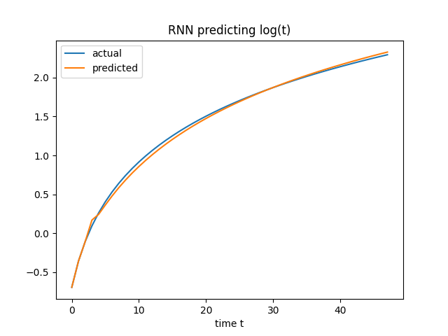
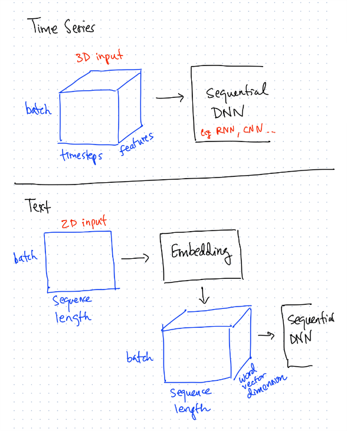

## LSTMs as Sequence Learners

An LSTM (or a GRU) can be used to learn a sequential function. 

`main.py` shows an example of an RNN used to predict the log(t) function, using a timestep of 3:

Unlike a multi-layer perceptron (MLP) which assumes inputs are independent, LSTMs (or GRUs) will receive both an input from the current timestep and a hidden state from the previous timestep. To enable this, we formulate the input shape for LSTMs (GRUs) as (batch, timesteps, features).

|Neuron Type|Input Shape|What is Learnt|
|---|---|---|
|RNN (LSTM/GRU)|Rows are independent, but each row contains N timesteps|Weighted combination of input features, PLUS hidden state from previous timestep. Longer-term sequential relationships.|
|MLP|Rows are independent|Weighted combination of input features only. No sequential concept assumed.|
|Convolution|Rows are independent, but each row contains N timesteps|Small filters slided across the timesteps. Short-term sequential relationships.|

### Input Shapes for Sequence Learners

The following summarises how to setup the input shapes for learning time sequences vs. text sequences.

|Domain|Input shape|
|---|---|
|Time Series|3-dimensional input of (batch, timesteps, features)|
|Text|2-dimensional input of (batch, sequence_length), passed into an Embedding layer, which will convert it to a 3-dimensional input of (batch, sequence_length, word_vector_dimension)|