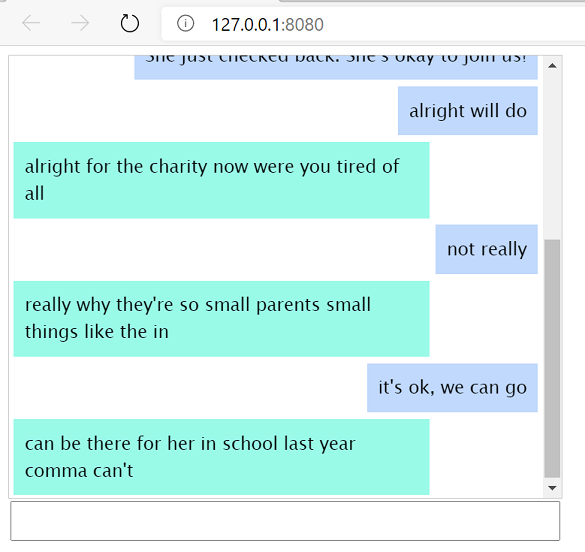

## Day 2: Basic Text Generation

### Setup
1. Train model to generate text (GPU preferred)
    ```
    python train.py
    ```
   
2. Run Flask app
   ```
    cd app/demo
    flask run
   ```
3. Go to http://localhost:8080. Type your chat responses, and the bot will reply with a sentence that is generated from choosing a random-selected seed word from your chat message.

    
