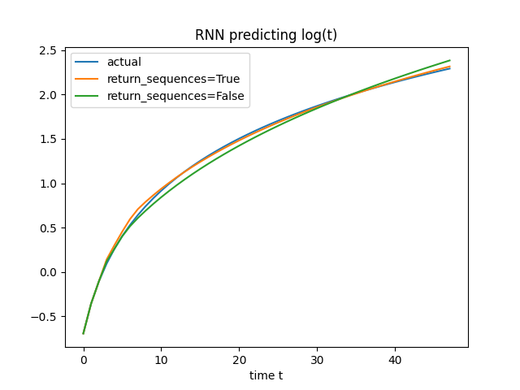
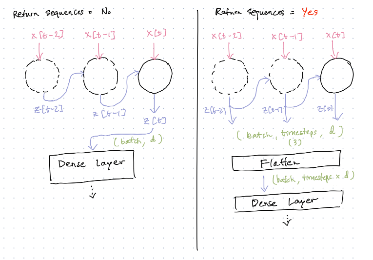
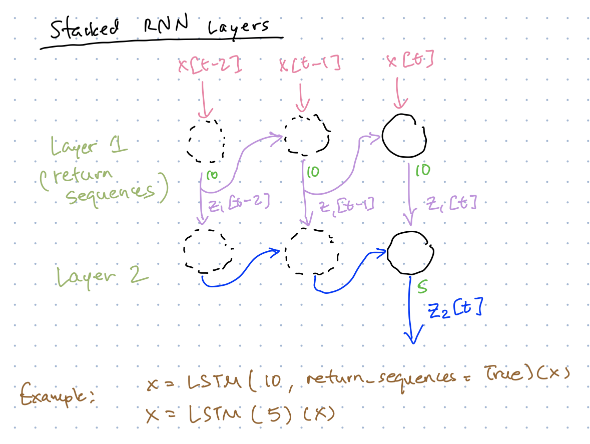

## Returning Sequences

An Recurrent Neural Network (LSTM or GRU) can be used to generate sequences.

Using the `return_sequences=True` parameter, an LSTM or GRU can return the (intermediate) output activations of every time step.

`returning_sequences.py` compares two RNNs used to predict the log(t) function. One returns sequences in its LSTM layer, and one doesn't:

The RNN with `return_sequences=True` has a closer fit to the original function.

The architectures compared:

Situations where this is useful:
- When the final output activation does not contain enough information for the next layers to learn.
- When stacking multiple LSTM or GRU layers, all layers except for the last LSTM/GRU will need to return sequences. This is because LSTM/GRUs expect inputs with the timesteps dimension (3D tensors).

An example of a stacked RNN:

Notes:
- `return_sequences` returns the output activations only. This is different from `return_state`, which returns the final hidden state. Hidden states are used for Sequence-to-Sequence networks (see Day 3).
