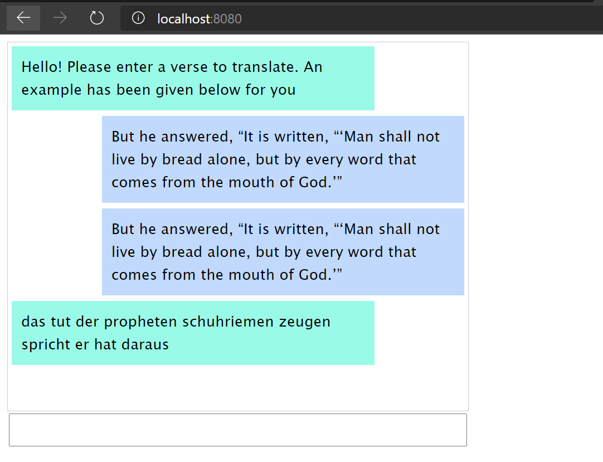
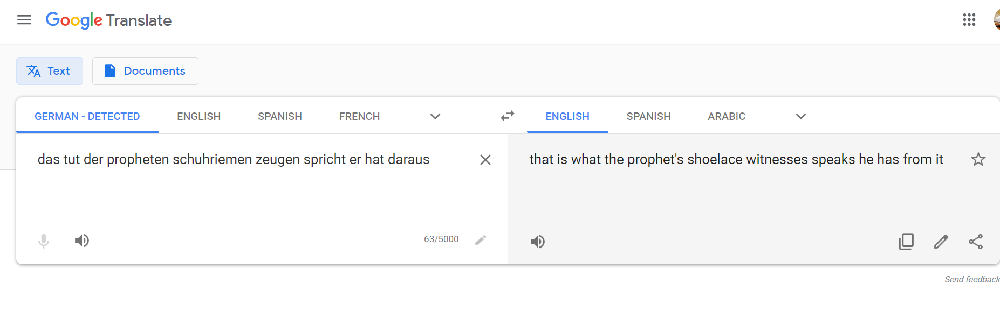

## Day 3: Neural Machine Translation (Seq2Seq)

### Setup
1. Train translation model
    ```
    cd train

    # You must complete the _ANS_ portions so that you can train the model
    python train.py
    ```
   
2. Run Flask app
   ```
    cd app
    flask run
   ```
3. Go to http://localhost:8080. Follow the prompt to type an input text in English, and the bot will reply with a translated sentence in German.

The example below is after training for 500 epochs.



Possible meaning?

