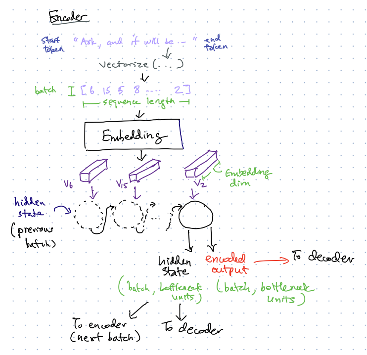

## Part 1: Encoder

The purpose of the encoder is to encode a lower-dimensional representation of the input sequence.
- The encoder will take the vectorized input sequence, perform an Embedding lookup to convert the input sequence to a word vector sequence [v[1], v[2], ..., v[sequence_len]]. 
- The encoder will also receive a hidden state so that it maintain some extra state (information) across batches:
  - During training, the encoder will receive the hidden state from the previous batch (or zeros if no previous batch)
  - During evaluation, the encoder will receive zeros as the hidden state.
- The encoder will output the activation (encoded_output) as well as the hidden state at the last sequence step of the GRU or LSTM. 
  - Both will be passed to the decoder to decode the current batch.
  - Only the hidden state will be passed to the encoder for the next training batch.
- Loss will only be computed at the output of the decoder (see task 3).

Note: the encoder is built using [Model subclassing](https://www.tensorflow.org/guide/keras/custom_layers_and_models), which is a technique to build custom models in Tensorflow Keras. This allows us to keep the encoder as a separate model from the decoder.

