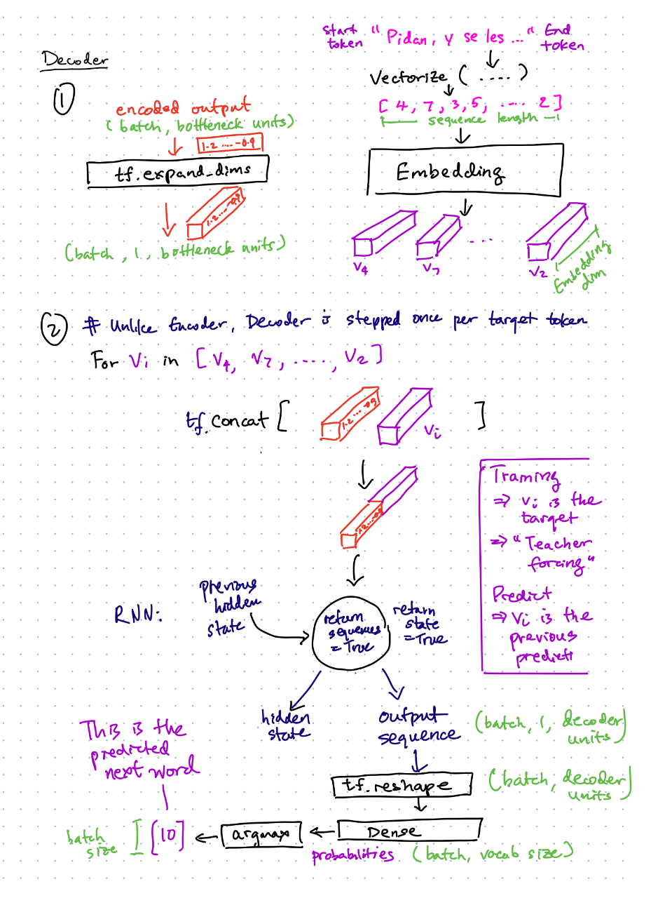

## Part 2: Decoder

The purpose of the decoder is to take the encoded output and a target token, and predict the next target token.
- The decoder runs once per target token, unlike the encoder which runs once per sequence.
- The decoder performs an Embedding lookup to convert the token into a vector. The vector is concatenated with the encoded output.
- The target token received by the decoder differs depending on whether we are training or predicting:
  - During training, the decoder will receive the true target token ("Teacher Forcing")
  - During prediction, the decoder will receive the previous predicted target token.
- The decoder will then step through the GRU or LSTM once, returning an output sequence and its hidden state. 
  - The output sequence will flattened and used to predict the next (t+1) token.
  - The hidden state will be passed back into the decoder for generating the (t+2) token.
- In summary there are 3 sources of information used by the decoder:
  - The encoder output: information about the source sequence
  - The previous target (t) token
  - The hidden state of the decoder: information about the target sequence so far (from 0 .. t)

Note: the decoder is built using [Model subclassing](https://www.tensorflow.org/guide/keras/custom_layers_and_models), which is a technique to build custom models in Tensorflow Keras. This allows us to keep the encoder as a separate model from the decoder.
