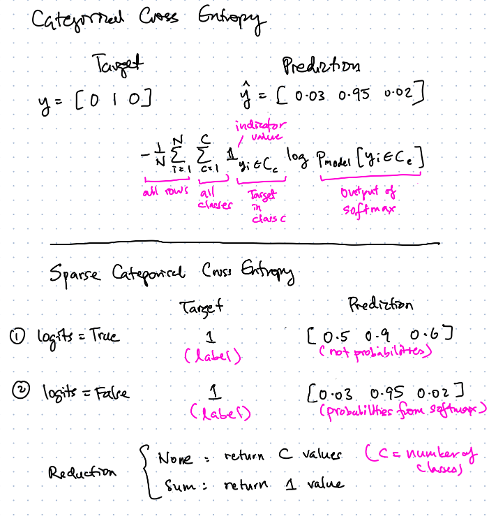

## Part 3: Loss Function

Sparse Categorical Cross Entropy (SCCE) function differs from the Categorical Cross Entropy (CCE) function in a few ways:
- Targets are integer labels for SCCE. This is useful when the number of classes is very large. An example will be the token indices return by text vectorization. For CCE, targets are one-hot encoded, which does not scale if there are many classes.
- Predictions can either be class probabilities or logits for SCCE. For CCE, predictions are class probabilities. Class probabilities involve the softmax activation.
- Optional reduction can be applied to the SCCE loss to sum up the losses to 1 number. Without reduction, 1 loss value is returned per class.

Besides the Sparse Categorical Cross Entropy Loss, we can define a custom loss function that handles special conditions, such as not penalising the loss when the target token is a padding token. See `main.py` for how this is done. A padding token just means that the target sequence is shorter than the max sequence length (determined by the source vectorizer).
