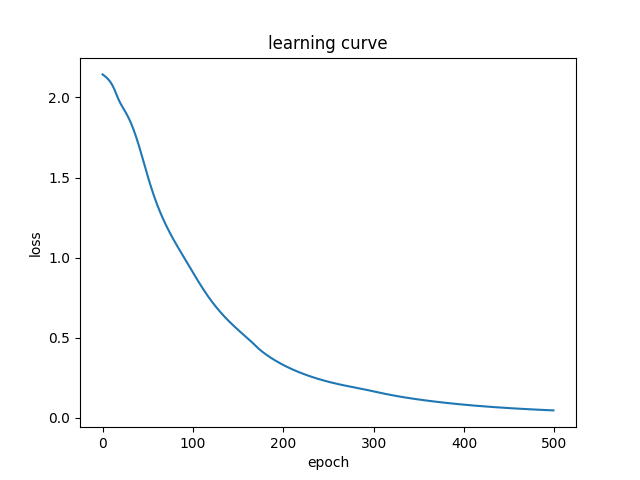

## Part 4: Training

The training process is as follows:

1. Pass the **sequence input** and **previous (batch's) encoder hidden state** through the encoder which returns the **encoded output** and the **encoder hidden state**.
2. Use "Teacher Forcing" to decide the next input to the decoder. Teacher Forcing is the technique where each target token is passed as the input to the decoder. For each target token:

    a. The **encoded output**, **encoder hidden state** and the **decoder input** (which is each target token) is passed to the decoder.
    
    b. The decoder returns the **predictions** and the **decoder hidden state**.
    
    c. The **decoder hidden state** is then passed back into the decoder and the **predictions** are used to calculate the loss.
    
4. The overall loss is summed up across target tokens for the batch, and used to calculate the gradients for backpropagation of the encoder and decoder weights.

Learning curve after training for 2000 epochs on the toy dataset:

[Reference](https://www.tensorflow.org/tutorials/text/nmt_with_attention)