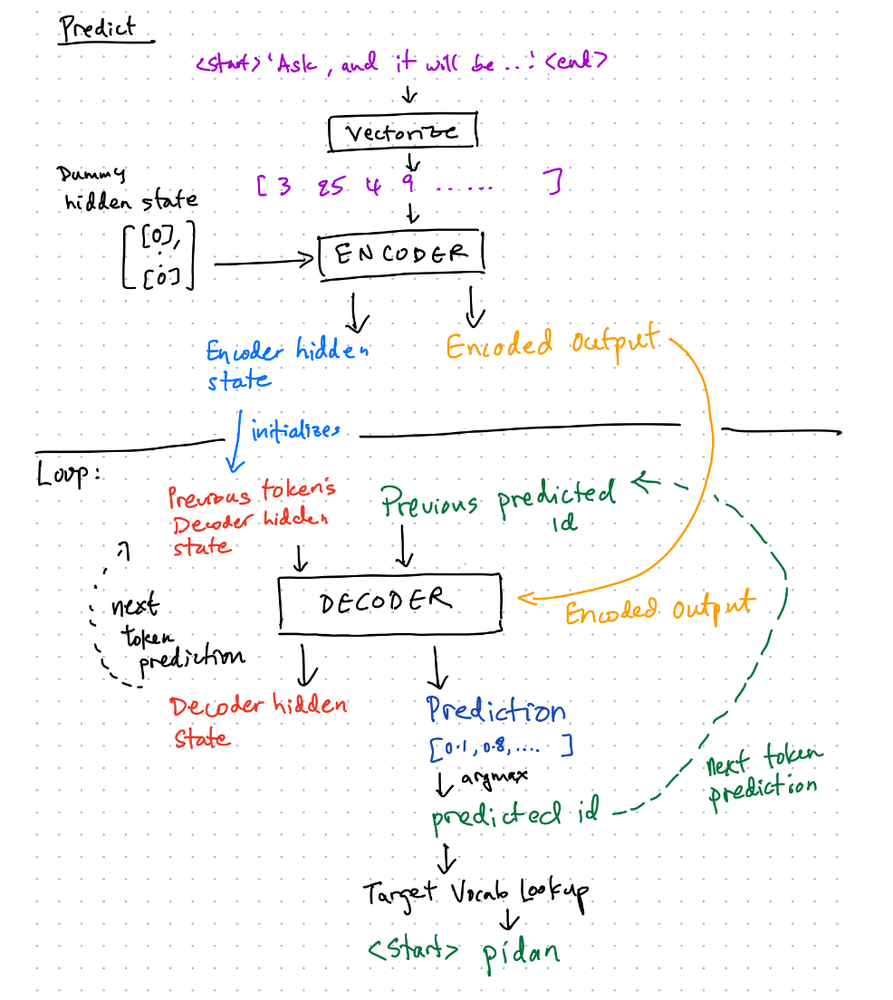

## Part 5: Predict

Given an input source text:

1. Vectorize the source text into an **input source sequence**, using the vectorizer created during preprocessing of the training set.

2. Pass the **input source sequence** and zeros to the encoder to get the **encoded output** and the **encoder hidden state**.

3. Set the first **decoder input** to the target start token. Set the first **decoder hidden state** to the **encoder hidden state**.

4. for t in range(max_target_sequence_length):

    a. The **encoded output**, **decoder hidden state** and the **decoder input** is passed to the decoder.
    
    b. The decoder returns the **predictions** and the **decoder hidden state**.
    
    c. Apply argmax to get the predicted label from the **predictions**.
      *  If the predicted label is the end token, exit the loop and return the **predicted target sequence**.
      *  Else, append the predicted label to the **predicted target sequence**. Set the predicted label as the **decoder input**, this will be passed back into the decoder for the next token.
