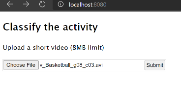
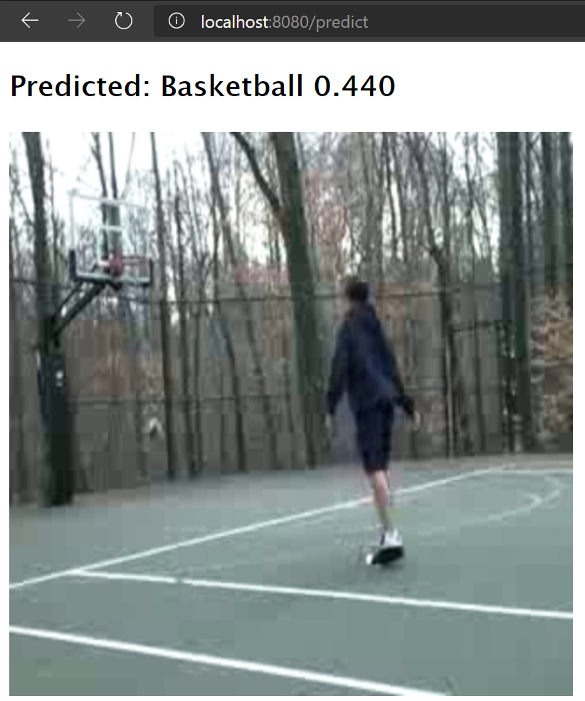

## Day 4: Video Classification

### Setup
1. Train  model
    ```
    cd train

    # You must complete the _ANS_ portions so that you can train the model
    python train.py
    ```
   
2. Run Flask app
   ```
    cd app
    flask run
   ```
3. Go to http://localhost:8080. Upload a video to be classified.




