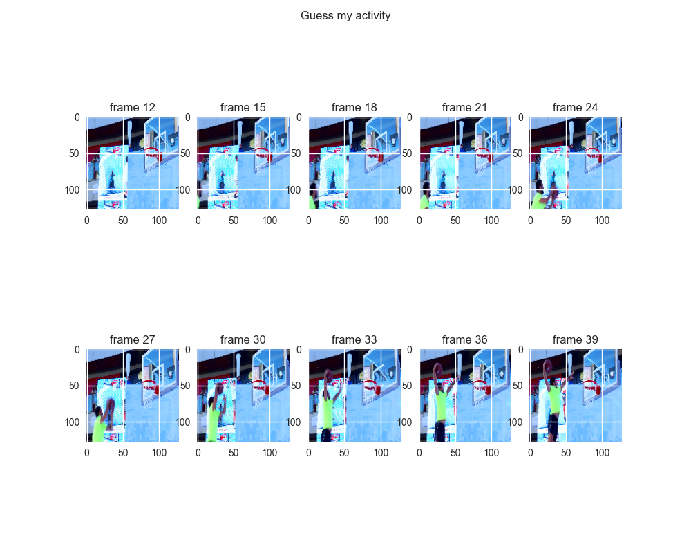

## Video Frame Extraction and Pre-processing

This is a demo of using [OpenCV](https://opencv.org/) to perform video frame extraction.

A video is a sequence of frames. Each frame will be extracted as an image and then pre-processed. As an example, we'll extract every 3rd frame, for sequence length of 20. How much video footage does that represent?

Many videos are 30 or 60fps. If our video is 30 frames per second (30fps):
 - Every frame is 1000 ms / 30 frames = 33.3ms
 - Every 3rd frame appears at 33.3ms * 3 = 100ms intervals
 - A sequence length of 20 frames accounts for 20 * 100ms = 2s of footage

Of course, we don't have to skip frames and can use every frame of the video "as is". Skipping frames is useful when the video is not capturing high-speed activities, and we want our RNNs to see acriss a longer time interval.

The pre-processing will use the `preprocess_input` function of a pre-trained ImageNet model [MobileNetV2](https://www.tensorflow.org/api_docs/python/tf/keras/applications/MobileNetV2). The end goal is to do some transfer learning using Parameter Extraction of a CNN, and then pass the sequence of extracted CNN image features to an RNN to perform classification.

Lastly, we will also resize the image to one of the [image sizes](https://www.tensorflow.org/api_docs/python/tf/keras/applications/mobilenet_v2) supported by MobileNetV2: (224, 192, 160, 128, and 96). For this demo, we'll choose 128, which is actually 128 pixels x 128 pixels x 3 channels.

The result should look like this:

