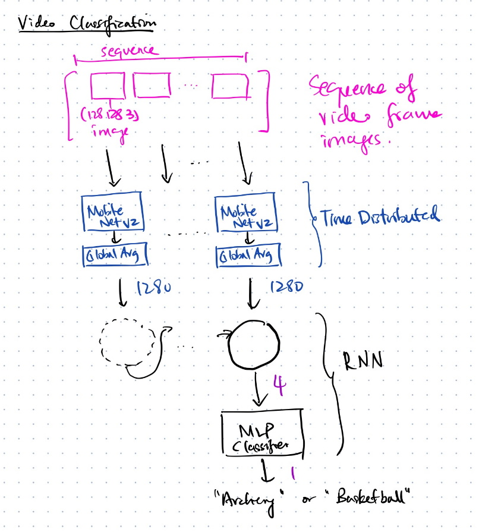

## Time Distributed CNN

1. Load the dataset from the previous task.

2. After train-test-split, use [tf.data.Dataset.from_tensor_slices](https://www.tensorflow.org/api_docs/python/tf/data/Dataset#from_tensor_slices) to create 
a batched dataset for training. Training set is batched up and repeated for batches per epoch.

3. To do parameter transfer:

 - Load the MobileNetV2 weights without the top classifier layers (`include_top=False`). Set it to non-trainable.
 
 - Apply a GlobalAveragePooling to flatten the output and average across the batch.
 
 - Wrap both layers into a [Time Distributed Layer](https://www.tensorflow.org/api_docs/python/tf/keras/layers/TimeDistributed). This will allow these layers to be called on every sequence step (=every frame), rather than just on the first frame.
 
 - Pass the output of the Time Distributed CNN layers to an RNN classifier to predict the activity being performed in the video.
 
Architecture:

