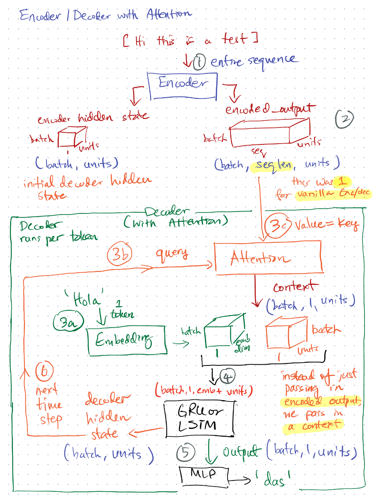

## Attention Layer

An [Attention](https://www.tensorflow.org/api_docs/python/tf/keras/layers/Attention) layer can be used to
learn which inputs are "most relevant" in the decisions made by an artificial neural network.

Attention layers were introduced in 2015 (for Neural Machine Translation), but the general principle can apply to sequence-to-sequence models. 

Attention (a variant called multi-headed self-attention!) is also the main element in Transformers. Transformers are tipped to be the successors to RNNs for sequential learning. We will cover an example of a Transformer in the next task.

The most basic Attention layer receives input in the form of query and key-value pairs:

|Application|Query Sequence|Key (maybe not sequence)|Value Sequence|
|---|---|---|---|
|Neural Machine Translation|target sequence|source sequence|source sequence|
|Recommendation System|target items|user profile|user purchase history|

* Notice that the query is referring to the **target**; while both the key and value refer to the **source**. This is backwards of how we usually think of queries, keys and values. The reason is that in Attention, we are trying to learn the relevance of sequential sources (represented by key-value) on predicting the sequential targets (represented by the query). 

* Attention is just a generic framework to learn dynamic scores on sequential inputs, so the concept of keys are included to allow for extraneous (possibly non-sequential) descriptive information on the inputs. In most cases, where there is no extraneous information about the sequential inputs, then key == value (the case for Neural Machine Translation).

* The "relevance" is computed as a **weighted sum of the key and query sequence**. This yields a set of dynamic scores for each step in the value sequence v[t] (remember, value sequence is the **source** sequence).

* The dynamic scores are then **applied to the value sequence using another weighted sum**. This yields a set of dynamically weighted values, where higher weightage at v[t] means more relevance (more "attention" is given). This is called the **context vector** and is concatenated with the input to the subsequent layers.

### Calculation

Inputs are query tensor of shape [batch_size, Tq, dim], value tensor of shape [batch_size, Tv, dim] and key tensor of shape [batch_size, Tv, dim]. The calculation follows the steps:

- Calculate scores with shape [batch_size, Tq, Tv] as a query-key dot product: `scores = tf.matmul(query, key, transpose_b=True)`.
- Use scores to calculate a distribution with shape [batch_size, Tq, Tv]: `distribution = tf.nn.softmax(scores)`.
- Use distribution to create a linear combination of value with shape [batch_size, Tq, dim]: `return tf.matmul(distribution, value)`.

### Usage notes:
- Attention perform a query-key dot product, so each query and key should ideally have a sequence dimension. Otherwise the dot product will just produce 1 number (not very useful as a probability distribution!).
- Therefore, make sure that your final RNN layer returns sequences.
- If using the classic `Attention` layer, the resulting context vector needs to be collapsed back into a single sequence dimension (using `tf.reduce.sum` or `tf.reduce.mean` depending on your domain), before concatenating it with the target. This will ensure that the sequence dimensions are the same.

### Application in Encoder-Decoder

- The Attention layer is applied at the Decoder.
- The Encoder is changed to return sequences. The sequences will be used as the value (and key) to the Attention layer.
- The Decoder's hidden state is the query. The initial hidden state will be set to the Encoder's output hidden state (same as vanilla Seq2Seq Encoder-Decoder)
- The Attention layer produces a context vector, which is a dynamically weighted combination of the Encoded sequence, summed together.
- The context vector is passed along to the LSTM or GRU (concatenated with the previous target token's embedding). Previously, in a vanilla Seq2Seq, the last encoded output was provided. *This way, the context vector can hold richer information that takes into account the **entire** Encoder sequence, rather than just the final value of the Encoder sequence.*

Further Enhancements:
* Neural Machine Translation with (Bahdanau) attention: https://www.tensorflow.org/tutorials/text/nmt_with_attention
* Self-attention: where key, value, and query 
* Global vs. Local attention: https://nlp.stanford.edu/pubs/emnlp15_attn.pdf
* Spatial vs. Temporal attention: https://www.groundai.com/project/where-and-when-to-look-spatio-temporal-attention-for-action-recognition-in-videos/1
