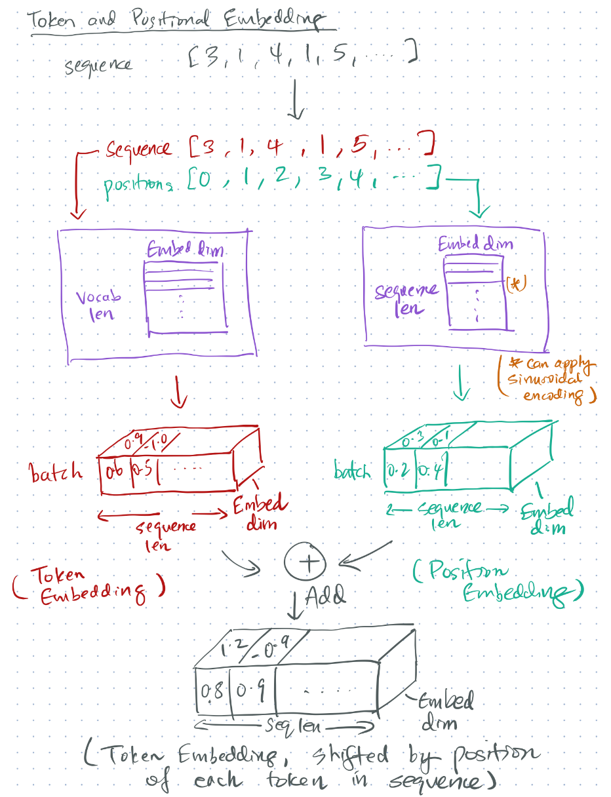
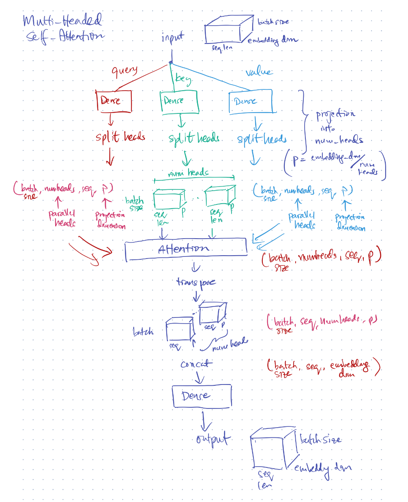

## Transformer

A Transformer consists of the following components:
- Token & Position Embedding:
- Multi-headed Self-attention

### 1. Token & Position Embedding

This is a way to embed sequence information without using a recurrent cell. We essentially pass the position indices (e.g. `[0, 1, 2, ...]`) as an extra input. Think of this like a cross-sectional approach where we pass in `[(0, token1), (1, token2), ....]` instead of `[token1, token 2, ...]`.

An Embedding layer produces the encoding into vectors. It is common to initialize the Embedding layer with a sinusoidal encoding. More details are described in [positional_encoding.md](positional_encoding.md)

The position embedding is **added** to the token embedding, to create the combined (position, token) encoding. You can think of it as different "biases" to the token encoding, to indicate where the token is located in the sequence.

### 2. Multi-headed Self-attention:

**Self-attention** means the query-key and value are all on the **same** sequence (hence "self"). It allows learning of contextual information (attention) on the source sequence based on the words in the source sequence. In comparison, Vanilla Attention uses a target (i.e. a different) sequence to learn contextual information on the source sequence.

**Multi-headed** means multiple parallel self-attention blocks are used. Analogous to having more neurons in Dense layer or channels in a Convolution layer to train more weights in parallel.
  

### Putting it Together: Transformer Encoder

`transformer.py` demonstrates the encoder portion of the Transformer model. The encoder can be used as a feature extractor for a sequence learning task, effectively as a drop-in replacement for RNNs.

The Encoder architecture is depicted in the left-hand side of this model:

### References
- https://keras.io/examples/nlp/text_classification_with_transformer/: Basic Transformer block
- https://www.tensorflow.org/tutorials/text/transformer: Application of Transformer in Encoder/Decoder.
